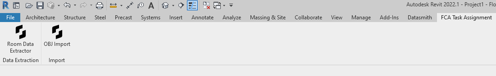

## Description

This is the Fernando Arantes source code of the task assignment to Snaptrude's Revit Developer position.
You can check the Revit add-in installing the "FCATaskAssignment 1.0.0.exe" in this repository release attachments.
The external commands will be placed in a new tab in Revit, named "FCA Task Assignment".
Note that this solution was made to work with the versions of Revit that you can download from the Autodesk Website: 2021, 2022, 2023 and 2024. 

## Room Data Extractor approach

The first idea that came to my mind was to get the geometry solids from the room and the family instances, and then use the class BooleanOperationUtils to get their intersections. There were two problems with this aproach: unmanageable exceptions and performance.
So I started looking in the documentation about other solutions and came across the Room property in the FamilyInstance Class. This is a automatic property that stores the room of the family instance based on the room calculation point inside the family. The problem with this property is that I cannot assume that all familiy instances will be correctly configured with the room calculation point. So I manage to get the familyInstances with the correctly Room property and stored them in a RoomData objects. After that I had to iterate the other family instances to find intersections within the solids.

After getting the occupied volume of each room, I did some simple calculations for the ratio and category and set them to the RoomData objects.
Finally, I used CsvHelper library to export the room data to a .csv file.

## Import OBJ Geometry into Revit approach

Initially, I did some research about the wavefront obj documentation and the creation of mesh objects in Revit. I found the TessellatedShapeBuilder class in the Revit API, that only needed points and faces to create GeometryObjects. Then I could used these geometryobjects to create DesignShape objects, that are model in place elements in Revit.
After that, I proceed to make a OBJ parser that could read each line of the file and create the XYZ points and the TesselatedFaces. 
I came across some doubts about the correct upaxis or the units that should be used. It would be simple to implement some UI to give the user some choices about these subjects, but the assignment didnt ask for any of this, so then I stopped the development.
